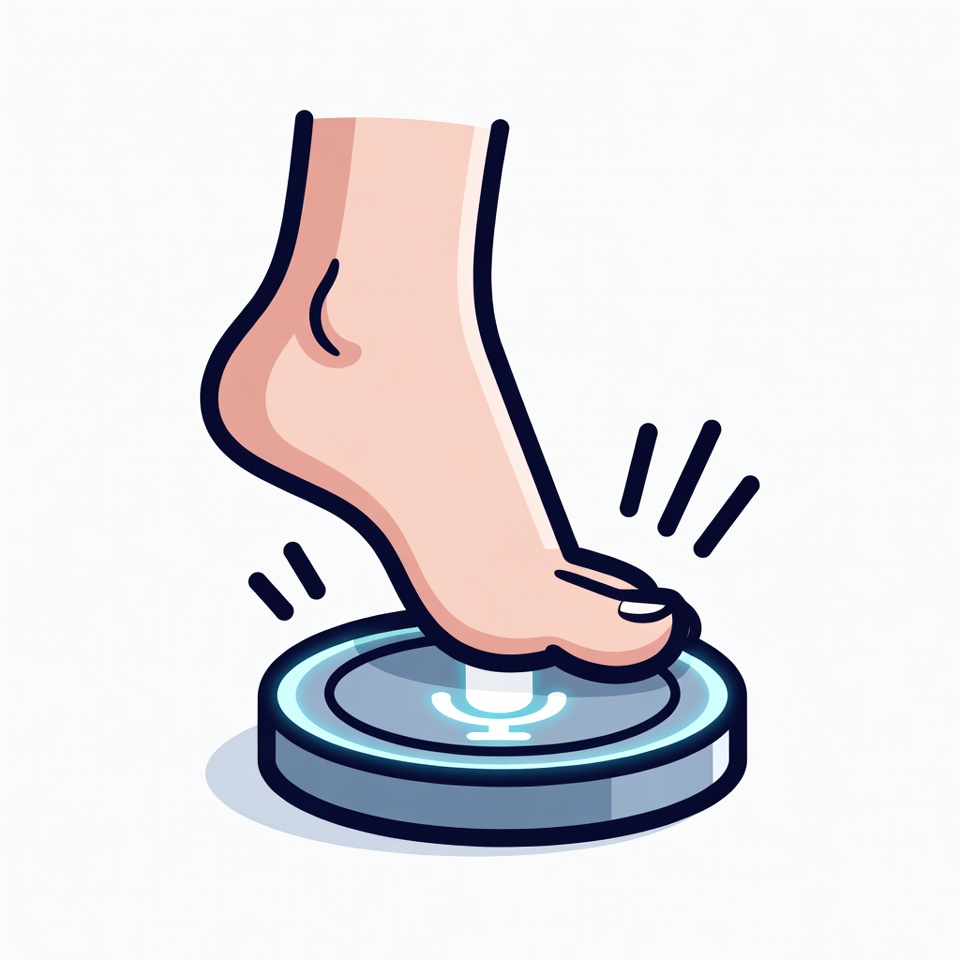

<p align="center">
  <video src="images/whisperfoot.mp4" width="600" controls></video>
</p>

# WhisperFoot

<p align="center">
  
</p>

<p align="center">
  <strong>A macOS utility that transforms a USB foot pedal into an Option (⌥) key</strong><br>
  Hands-free modifier key access for accessibility, productivity, and creative workflows.
</p>

## The Problem

Many workflows benefit from holding the Option key while performing other actions—Option-click to access alternate menu items, Option-drag to duplicate files, or push-to-talk in voice applications. But holding a modifier key while simultaneously using your mouse or keyboard can be awkward or impossible for some users.

USB foot pedals are inexpensive (~$15) and widely available, but they typically only send a single keystroke (like "b") rather than acting as a proper modifier key. macOS doesn't natively support remapping arbitrary USB devices to modifier keys, and existing tools like Karabiner-Elements work at the keyboard level, not the USB device level.

There's also a trust issue: keyboard and input device software has access to everything you type. Installing closed-source binaries from third parties means trusting unknown code with your most sensitive data—passwords, messages, credentials. If you're security-conscious, building from auditable source code is the better choice. This project serves as both a working tool and an example of how to build your own input device remapping on macOS.

## The Solution

WhisperFoot intercepts input from a specific USB foot pedal at the hardware level using macOS IOKit, blocks its native keystroke, and injects proper Option key modifier events. The result is a foot pedal that behaves exactly like holding the Option key on your keyboard.

## Who This Is For

- **Accessibility users** who have difficulty holding modifier keys while clicking or typing
- **Audio/video professionals** using push-to-talk in apps like  [Wispr Flow](https://wispr.com/), Discord, or Zoom
- **Power users** who want hands-free access to Option-click behaviors
- **Anyone** who wants to reduce repetitive strain from awkward key combinations

## Who This Is Not For

- Users who need to remap foot pedals to arbitrary keys (this only maps to Option)
- Users on Windows or Linux (macOS only)
- Users who need the foot pedal's original keystroke to pass through

## Supported Hardware

**Primary:** iKKEGOL USB Foot Pedal Switch (Model FS2007U1SW)
- Single pedal, USB HID device
- Available on Amazon for ~$15

**Other pedals** may work if they present as USB HID devices. Use the included discovery script to find your pedal's Vendor ID and Product ID.

## Features

- **True modifier key behavior** — holds Option for as long as you hold the pedal
- **Push-to-talk support** — works with voice apps that respond to Option key
- **Toggle mode** — double-tap for apps that toggle on Option press
- **Menu bar icon** — shows connection status and pedal state
- **Enable/disable toggle** — quickly disable without quitting
- **Runs at login** — LaunchAgent starts the app automatically
- **Zero configuration for supported pedals** — detects iKKEGOL pedals automatically

## Requirements

- macOS 12.0 (Monterey) or later
- Xcode Command Line Tools (`xcode-select --install`)
- A USB foot pedal (see Supported Hardware)

## Installation

### 1. Clone and Build

```bash
git clone https://github.com/terrancemacgregor/footpedal-option-key.git
cd footpedal-option-key
./scripts/streamdeck/build-and-install.sh
```

This single script compiles, bundles, code-signs, installs to `/Applications`, and starts the service. It opens a Terminal window to show progress.

### 2. Configure Your Pedal (if not using iKKEGOL)

For iKKEGOL pedals, skip this step — defaults work automatically.

For other pedals, discover your device's USB IDs:

```bash
./scripts/discover-pedal.sh
```

Then configure:

```bash
./scripts/configure-pedal.sh 0xVENDOR_ID 0xPRODUCT_ID
```

### 3. Grant Permissions

The app requires Accessibility permissions to inject keyboard events.

1. Open **System Settings → Privacy & Security → Accessibility**
2. Click **+**
3. Navigate to `/Applications/WhisperFoot.app`
4. Ensure it's toggled **ON**
5. Re-run `./scripts/streamdeck/build-and-install.sh` to restart the service

> **Note:** macOS ties permissions to the app signature. After every reinstall, you must remove and re-add the app in Accessibility settings, then restart it.

The app will start automatically on future logins via LaunchAgent.

## Usage

Once running, a menu bar icon indicates status:

| Icon | State |
|------|-------|
| ○ | Pedal disconnected |
| ● | Pedal connected |
| 🦶 | Pedal pressed |

**Hold mode:** Press and hold the pedal to hold Option. Release to release.

**Toggle mode:** Double-tap quickly for apps that toggle on Option press (like some push-to-talk implementations).

Click the menu bar icon to:
- See connection status
- Enable/disable the pedal
- Quit the application

## Configuration

Configuration is stored in `~/.config/footpedal/config.json`:

```json
{
    "vendorID": 13651,
    "productID": 45057
}
```

To find your pedal's IDs, run `./scripts/discover-pedal.sh`.

## Scripts Reference

| Script | Purpose |
|--------|---------|
| `scripts/streamdeck/build-and-install.sh` | Build, install, and start WhisperFoot (opens Terminal) |
| `scripts/streamdeck/stop-and-uninstall.sh` | Stop, uninstall, and clean up everything (opens Terminal) |
| `scripts/discover-pedal.sh` | Find USB Vendor/Product IDs for your pedal |
| `scripts/configure-pedal.sh` | Save pedal IDs to config file |

The StreamDeck scripts are designed to be triggered from an Elgato Stream Deck button but work equally well from the command line. They detect whether they're running in a terminal and open one if needed.

## Logs

- Standard output: `/tmp/footpedal.log`
- Errors: `/tmp/footpedal.error.log`

View live:
```bash
tail -f /tmp/footpedal.log
```

## How It Works

1. **Device Identification:** Uses IOKit HID Manager to monitor USB devices matching the configured Vendor ID and Product ID
2. **Input Capture:** Registers callbacks for device connection, disconnection, and input events
3. **Event Blocking:** An event tap intercepts the pedal's native keystroke (typically "b") and blocks it
4. **Modifier Injection:** Posts `flagsChanged` events with the Option modifier flag via CGEvent
5. **Modifier Application:** While the pedal is held, adds the Option modifier to all keyboard and mouse events

This approach works at the correct abstraction layer—below the keyboard driver but above the raw USB level—ensuring compatibility with all applications.

## Troubleshooting

### Pedal not detected

1. Verify the pedal is connected: `system_profiler SPUSBDataType`
2. Check your Vendor/Product IDs: `./scripts/discover-pedal.sh`
3. Update config if needed: `./scripts/configure-pedal.sh`

### Option key not working / "b" still appears

The app needs Accessibility permissions. **This must be re-done after every reinstall.**

1. Go to **System Settings → Privacy & Security → Accessibility**
2. If WhisperFoot.app is already listed, **remove it first**
3. Click **+** and add `/Applications/WhisperFoot.app`
4. Ensure it's toggled **ON**
5. Re-run `./scripts/streamdeck/build-and-install.sh` to restart the service

macOS ties permissions to the app signature, so reinstalling invalidates previous grants. The app must be restarted after granting permissions.

### App not starting at login

Verify the LaunchAgent is loaded:
```bash
launchctl list | grep footpedal
```

If not listed, run `./scripts/streamdeck/build-and-install.sh`.

### Double events / erratic behavior

Some pedals expose multiple HID interfaces. The app includes 100ms debouncing to handle this. If issues persist, try disconnecting and reconnecting the pedal.

## Uninstalling

```bash
./scripts/streamdeck/stop-and-uninstall.sh
```

This removes the app from `/Applications`, the LaunchAgent, log files, config, and Accessibility permissions.

## Contributing

Contributions are welcome. Please:

1. Fork the repository
2. Create a feature branch
3. Submit a pull request with a clear description

For bug reports, include:
- macOS version
- Pedal make/model
- Output of `/tmp/footpedal.log` and `/tmp/footpedal.error.log`

## License

MIT License. See [LICENSE](LICENSE) for details.

## Acknowledgments

Built with:
- [IOKit](https://developer.apple.com/documentation/iokit) for USB HID device access
- [CGEvent](https://developer.apple.com/documentation/coregraphics/cgevent) for keyboard event injection
- [AppKit](https://developer.apple.com/documentation/appkit) for the menu bar interface
